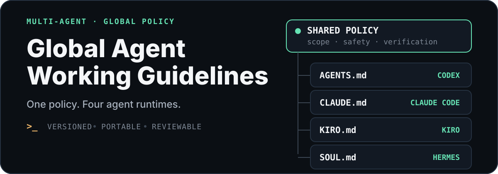

<p align="center">
  
</p>

# Global Agent Working Guidelines

<p align="center">
  <strong>为多个 AI 编码代理维护一致、可审阅、可回退的全局工作准则。</strong><br>
  约束代理先核实、少改动、守边界、做验证，再宣布完成。
</p>

这个仓库把同一组核心原则适配到不同 Agent 的原生加载入口。它解决的是跨项目的工作方式，不替代项目架构文档、Skills、Hooks、CI 或权限配置。

> [!NOTE]
> 本项目统称这些文件为“全局提示词”，但它们的注入机制并不相同：Codex、Claude Code 和 Kiro 将文件作为持久指令上下文加载；Hermes 把 `SOUL.md` 放入系统提示词的身份槽位。

## 一套原则，四个运行时

| Agent | 仓库源文件 | 默认全局位置 | 加载语义 |
| --- | --- | --- | --- |
| Codex / Codex CLI | [`AGENTS.md`](./AGENTS.md) | `~/.codex/AGENTS.md` | 用户级默认；项目和子目录规则按作用域叠加 |
| Claude Code | [`CLAUDE.md`](./CLAUDE.md) | `~/.claude/CLAUDE.md` | 用户级指令；项目、local 和路径规则随后加载 |
| Kiro IDE / CLI | [`KIRO.md`](./KIRO.md) | `~/.kiro/steering/AGENTS.md` | 全局 steering；工作区 steering 优先 |
| Hermes Agent | [`SOUL.md`](./SOUL.md) | `~/.hermes/SOUL.md` | 实例级身份与长期行为；替换内置身份块 |

四份文件共享相同的行为核心，只在身份、加载作用域和工具权限术语上保留必要差异。

## 快速安装

在 Linux 或 WSL 中，把仓库克隆到准备长期保留的固定路径，然后使用项目脚本检查并安装符号链接：

```bash
bash scripts/configure-global-links.sh --check
bash scripts/configure-global-links.sh --install
```

`--install` 会为 Codex、Claude Code、Kiro 和 Hermes 预先创建全局入口。已有文件或错误链接不会被覆盖，而是移动到 `~/.local/state/ai-build-up/backups/` 后再建立链接；重复运行不会创建额外备份。`CODEX_HOME`、`KIRO_HOME`、`HERMES_HOME` 和 `XDG_STATE_HOME` 会在设置时得到尊重。

<details>
<summary>手动安装</summary>

```bash
PROMPT_REPO="/absolute/path/to/System Prompt"

mkdir -p "$HOME/.codex" "$HOME/.claude" "$HOME/.kiro/steering" "$HOME/.hermes"

ln -s "$PROMPT_REPO/AGENTS.md" "$HOME/.codex/AGENTS.md"
ln -s "$PROMPT_REPO/CLAUDE.md" "$HOME/.claude/CLAUDE.md"
ln -s "$PROMPT_REPO/KIRO.md" "$HOME/.kiro/steering/AGENTS.md"
ln -s "$PROMPT_REPO/SOUL.md" "$HOME/.hermes/SOUL.md"
```

手动命令故意不使用强制覆盖选项。如果目标文件已经存在，请先比较内容并移动到备份路径。Hermes 通常会在首次运行时生成默认 `SOUL.md`，部署本仓库版本前尤其需要先审阅原文件。

</details>

Windows 原生环境创建符号链接可能需要 Developer Mode 或管理员权限。不方便使用符号链接时可以复制文件，但后续更新需要手动重新同步。

## 确认已经生效

修改后启动新会话，再检查实际加载来源：

| Agent | 验证方式 |
| --- | --- |
| Codex | 运行 `codex --ask-for-approval never "Summarize the current instructions."` |
| Claude Code | 在交互会话中运行 `/memory`，查看已加载的 `CLAUDE.md` |
| Kiro CLI | 运行 `/context show`；Kiro IDE 可在 Steering 面板确认 global 文件 |
| Hermes | 先运行 `hermes prompt-size` 检查提示词组成，再让新会话概述长期工作准则 |

这些检查验证“文件被加载”；真实效果还应通过日常任务观察，并根据重复出现的偏差继续精修规则。

## 更新闭环与恢复

符号链接把这个仓库变成当前电脑的配置源：日常使用中发现稳定、可复现的改进项后，直接修改对应源文件，审阅并验证差异，再提交到 Git。其他电脑拉取同一仓库后会立即获得文件更新；Agent 已经启动时仍应开启新会话，让它重新加载指令。

如果本机仓库被误删，链接会失效，但目标工具的其他状态不会被删除。把远程仓库重新克隆到原路径即可恢复现有链接；如果改用了新路径，重新运行 `--install`。源文件、Git 远程和各电脑 checkout 共同提供可审阅、可回退的恢复链路，认证信息和机器专属配置不应写入本仓库。

## 指令应该放在哪一层

| 层级 | 适合内容 | 不适合内容 |
| --- | --- | --- |
| 全局文件 | 跨仓库工作方式、安全边界、验证标准 | 单个项目的命令、架构和端口 |
| 项目指令 | 构建命令、代码风格、目录约定、架构决策 | 所有项目都要重复的个人偏好 |
| Skill | 有明确触发条件的多步骤流程和参考资料 | 每轮都必须携带的短规则 |
| Hook / CI / 权限配置 | 必须机械执行的生命周期检查与访问控制 | 依赖模型自行判断的软偏好 |
| 当前会话 | 临时目标、一次性约束、当前任务背景 | 需要跨会话长期保持的规则 |

Hermes 的全局 `SOUL.md` 与项目级 `AGENTS.md` 是独立层：前者定义实例身份和长期行为，后者保存项目约定。

## 维护方式

1. 先在 `AGENTS.md` 中形成通用行为规则。
2. 同步到 `CLAUDE.md`、`KIRO.md` 和 `SOUL.md`，保留各工具的作用域和权限术语。
3. 检查每一行是否真的改变代理行为，删除重复、失效和只复述默认行为的内容。
4. 运行 `bash tests/test-configure-global-links.sh` 和 `git diff --check`，审阅完整 diff，再分别启动新会话验证加载；PR 和 `main` 推送会重复执行链接管理测试。
5. 将一组逻辑完整的变化保存为独立提交，便于比较效果和安全回退；其他电脑拉取后运行 `bash scripts/configure-global-links.sh --check` 检查漂移。

## 官方文档

- [Codex：Custom instructions with AGENTS.md](https://learn.chatgpt.com/docs/agent-configuration/agents-md)
- [Claude Code：How Claude remembers your project](https://code.claude.com/docs/en/memory)
- [Kiro：Steering](https://kiro.dev/docs/steering/)
- [Hermes Agent：Context Files](https://hermes-agent.nousresearch.com/docs/user-guide/features/context-files)
- [Hermes Agent：Personality & SOUL.md](https://hermes-agent.nousresearch.com/docs/user-guide/features/personality/)
